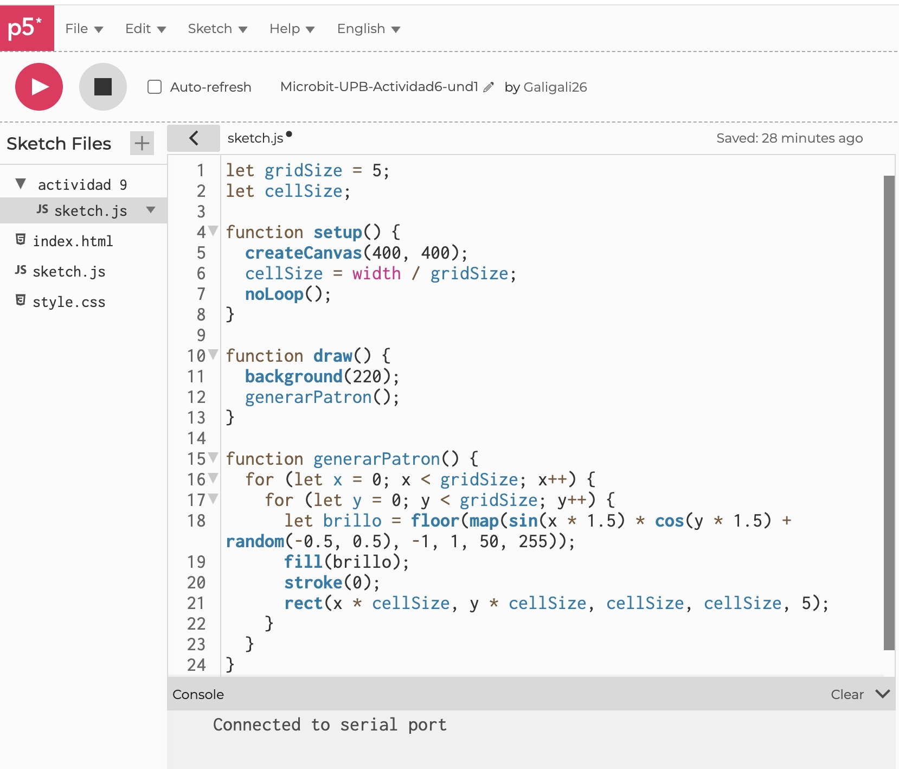

### Funciones y modificaciones:
Funciones utilizadas:
sin(x) * cos(y)

Se utiliza para el brillo, creando un patrón ondulado.
Modificado con x * 1.5 y y * 1.5 para ajustar la frecuencia de la onda.
random(-0.5, 0.5)

Se agregó para introducir una variación aleatoria en cada celda, haciendo que el patrón no sea completamente repetitivo.
map(value, -1, 1, 50, 255)

Convierte los valores generados por sin(x) * cos(y) a un rango de brillo entre 50 (casi apagado) y 255 (máxima intensidad).

Para que los LEDS tengan diferente iluminación.
floor(value)

Redondea los valores de brillo a enteros para evitar problemas de representación en fill().

Se aumentó el factor de multiplicación en sin(x * 1.5) * cos(y * 1.5) para cambiar la figuras de las luces.
Random(-0.5, 0.5) para hacer las formas diferentes.
Se ajustó el rango de brillo en map() para evitar que los LEDs estén completamente apagados o demasiado brillantes.

